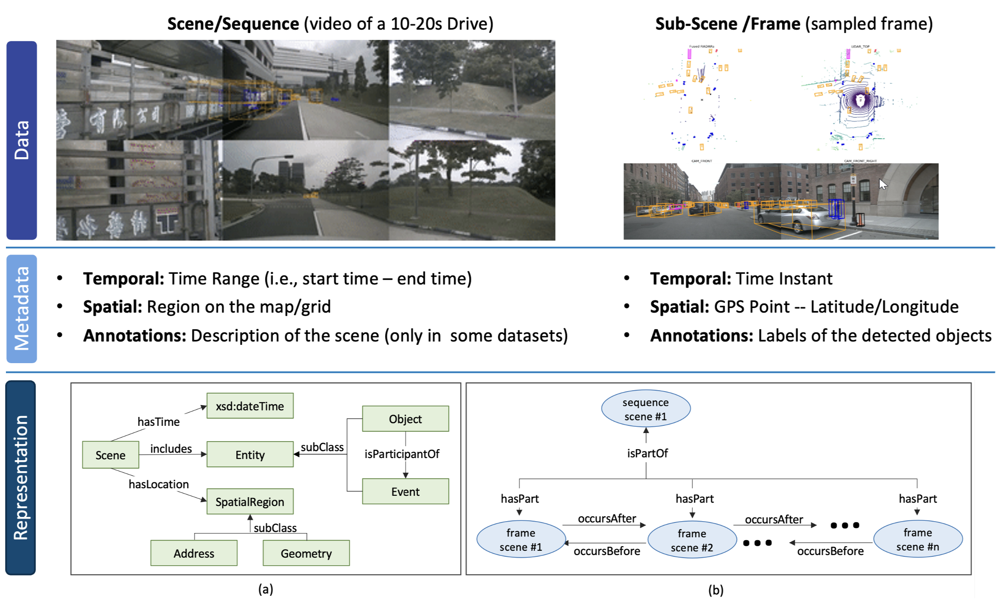
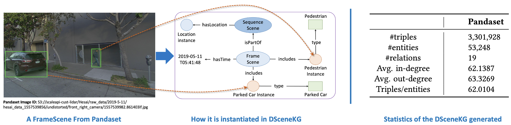

# DSceneKG
A Suite of Knowledge Graphs of Driving Scenes

This repository contains Knowledge Graphs developed to represent driving scenes from openly available autonomous driving datasets. 


## Highlights: 
1. DSceneKG is conformant to the domain-specific ontology, Driving Scenes Ontology ([DSO](https://www.ncbi.nlm.nih.gov/pmc/articles/PMC8656233/)) that represents the semantic structure of the scenes.
2. In the DSO, scenes are categorized into two types: (1) Sequence Scene – A video of 10-20 seconds, with a location region and temporal range; (2) Frame Scene – A sampled snapshot from the video, with a location point and timestamp.
3. All annotated scenes are then instantiated as a Knowledge Graph as shown below:


## Accessing DSceneKG:
- Download [```DSceneKG-Pandaset.ttl```](https://drive.google.com/file/d/15pI4J3WYeoD4uBsbtUNIh51eegVThOAe/view?usp=sharing). This contains the turtle serialized full KG developed from the scene data in [Pandaset](https://pandaset.org/) dataset.


## Use-cases of DSceneKG:
1.  Knowledge-based entity prediction (KEP) - enabling a knowledge-based approach for predicting entities in driving scenes [1].
2. Context-based method for labeling unobserved entities (CLUE) - completing AD datasets with labels for entities that may have gone unobserved or unlabeled [2].
3. Explainable scene clustering - typing automotive scenes into explainable, high-level semantic clusters [3].
4. Semantic-based scene similarity - identifying automotive scenes that are semantically similar, but may be visually dissimilar [4].
5. Causal discovery - enabling root-cause analysis/ causal discovery in driving scenes [5].
6. Knowledge-based retrieval - enhancing Bird’s-Eye View (BEV) retrieval by integrating semantic representations with textual descriptions [6]

## References:
1. Wickramarachchi, Ruwan, Cory Henson, and Amit Sheth. "Knowledge-infused learning for entity prediction in driving scenes." Frontiers in big Data 4 (2021): 759110.
2. Wickramarachchi, Ruwan, Cory Henson, and Amit Sheth. "CLUE-AD: A context-based method for labeling unobserved entities in autonomous driving data." Proceedings of the AAAI Conference on Artificial Intelligence. Vol. 37. No. 13. 2023.
3. Nag Chowdhury, S., Wickramarachchi, R., Gad-Elrab, M. H., Stepanova, D., & Henson, C. (2021). Towards leveraging commonsense knowledge for autonomous driving. In 20th International Semantic Web Conference (ISWC). 
4. Wickramarachchi, R., Henson, C., & Sheth, A. (2020). An evaluation of knowledge graph embeddings for autonomous driving data: Experience and practice. AAAI-MAKE.
5. Jaimini, U., & Sheth, A. (2022). CausalKG: Causal Knowledge Graph Explainability using interventional and counterfactual reasoning. IEEE Internet Computing, 26(1), 43-50.
6. Wei, D., Gao, T., Jia, Z., Cai, C., Hou, C., Jia, P., ... & Wang, Y. (2024). BEV-CLIP: Multi-modal BEV Retrieval Methodology for Complex Scene in Autonomous Driving. arXiv preprint arXiv:2401.01065.

